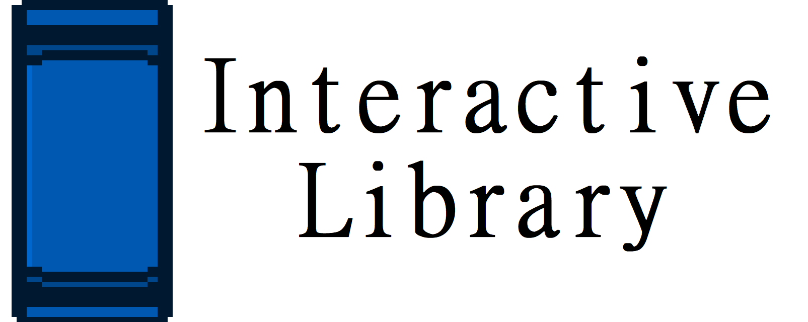

# Interactive Library
An interactive and customizable plain text reader with partial RTL support made with Godot. Currently supports the following formats: .txt, .log, .lst, .cfg, .nfo, .dat, .ini

